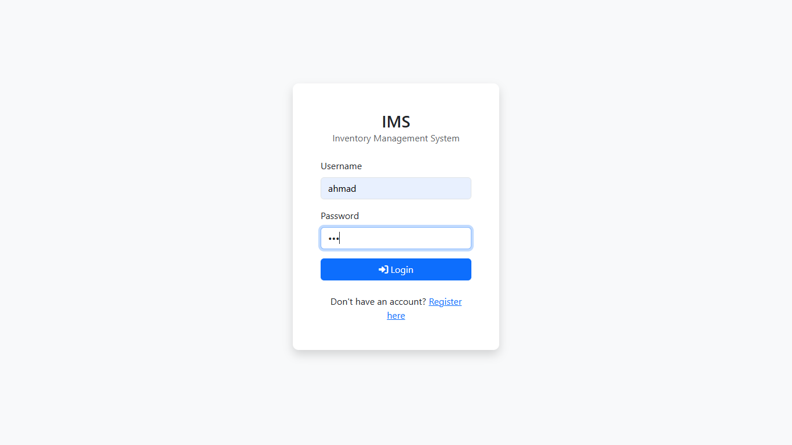
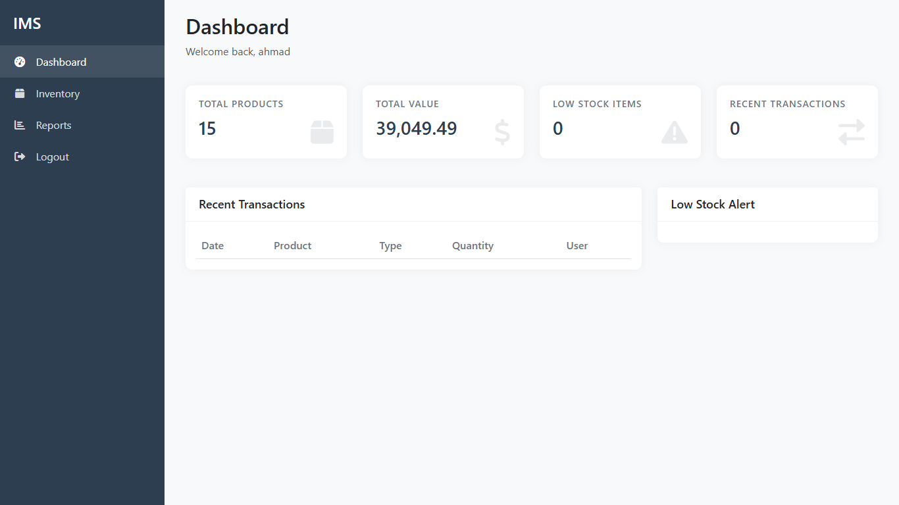
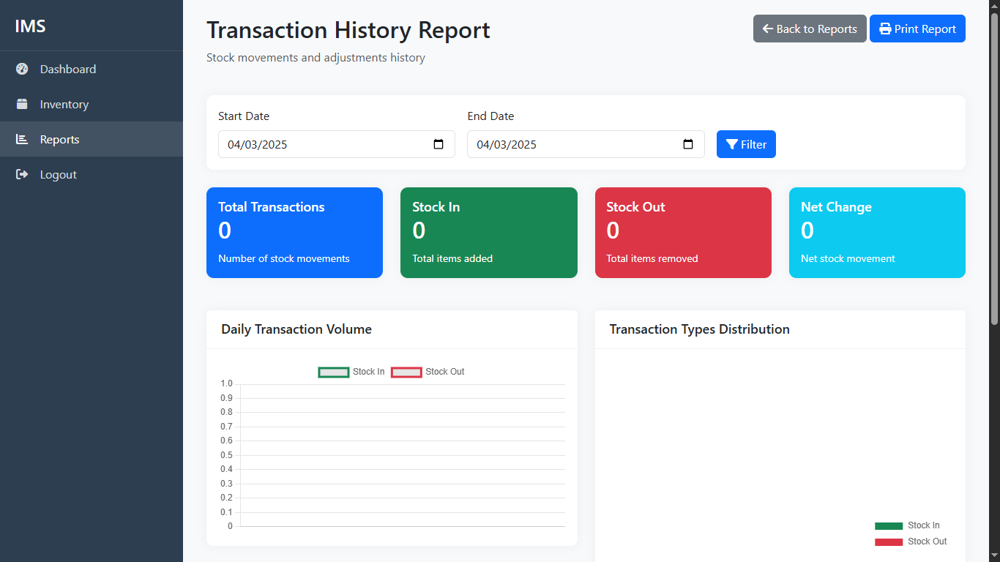
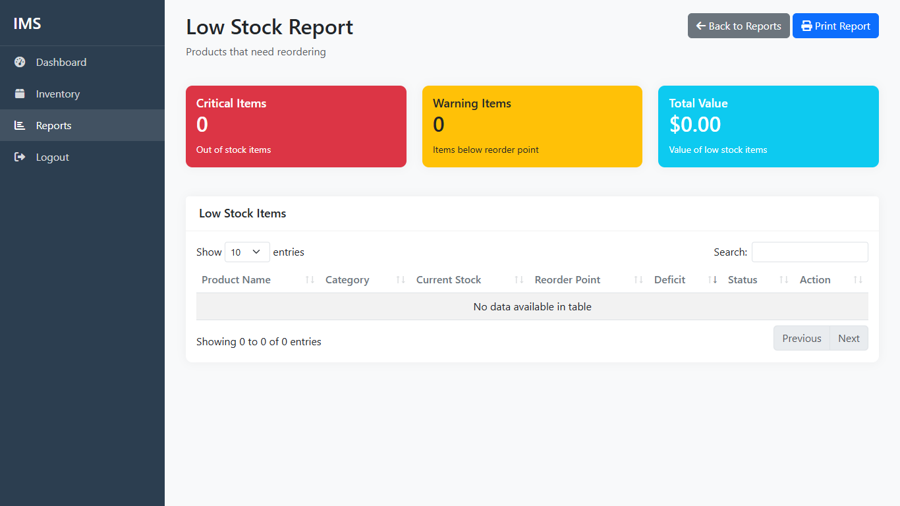
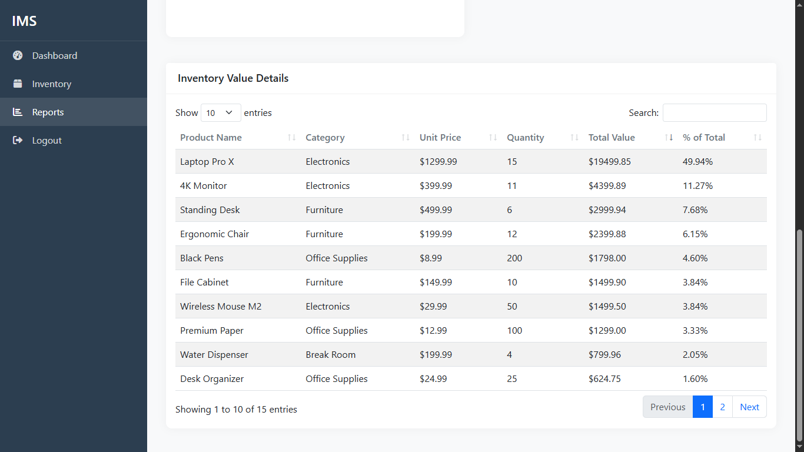
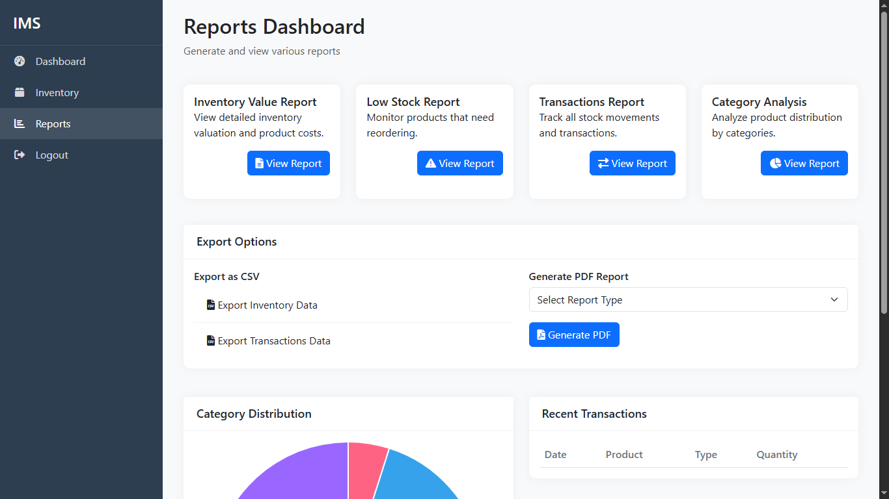
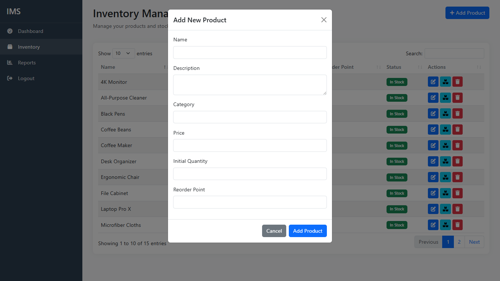

# Inventory Management System

A professional inventory management system designed to streamline and manage inventory operations efficiently.

## Features

- User authentication and management
- Inventory tracking and reporting
- Dashboard with visual analytics
- Transaction history
- Low stock alerts

## Screenshots

Here are some screenshots of the application:

- **Login Screen**: 
- **Dashboard**: 
- **Transaction History**: 
- **Low Stock Report**: 
- **Inventory Details**: 
- **Reports**: 
- **Modal Example**: 

## Installation

1. Clone the repository:
   ```bash
   git clone <repository-url>
   cd inventory-management-system
   ```

2. Install dependencies:
   ```bash
   npm install
   ```

3. Set up environment variables:
   - Create a `.env` file in the root directory and add your environment variables.

4. Initialize the database:
   ```bash
   npm run init-db
   ```

5. Seed the database with initial data:
   ```bash
   npm run seed-products
   ```

## Usage

- Start the application:
  ```bash
  npm start
  ```

- For development mode with live reloading:
  ```bash
  npm run dev
  ```

## Built With

- [Express](https://expressjs.com/) - Web framework for Node.js
- [SQLite3](https://www.sqlite.org/index.html) - Database engine
- [EJS](https://ejs.co/) - Embedded JavaScript templating
- [Chart.js](https://www.chartjs.org/) - JavaScript charting library

## License

This project is licensed under the MIT License. 